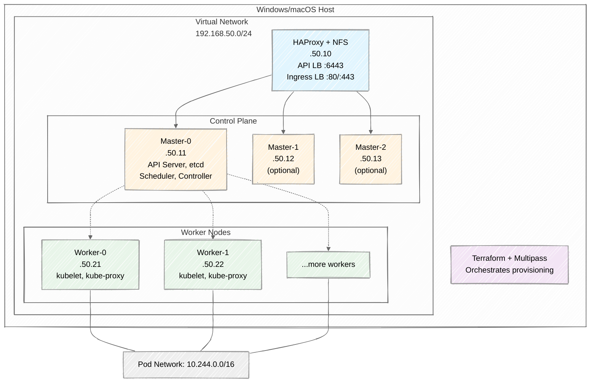
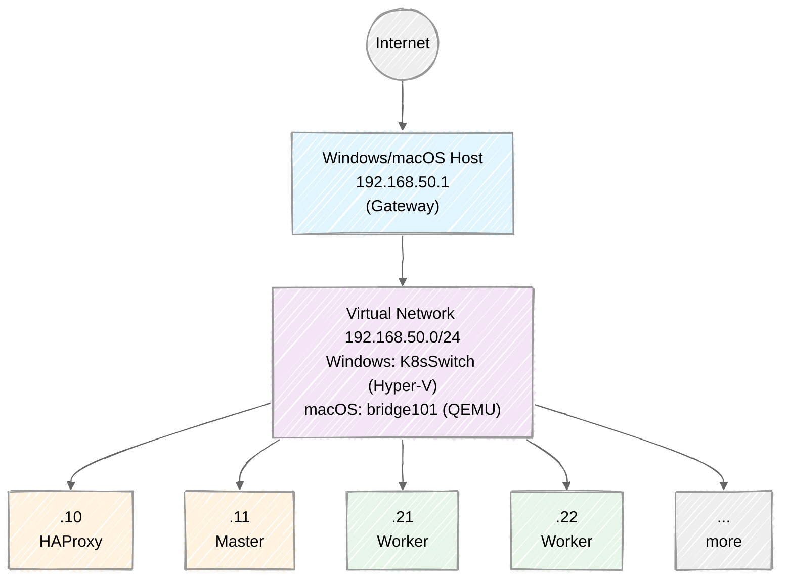
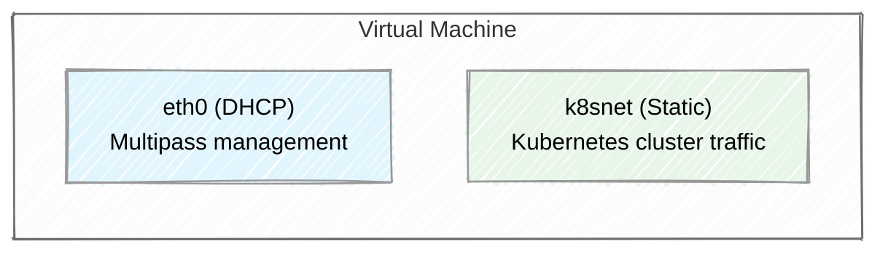
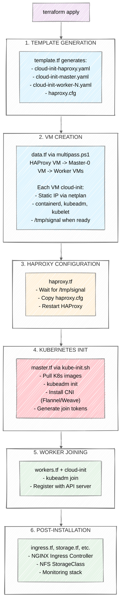

# Local Kubernetes Cluster Configuration Guide

This document explains the architecture and configuration of the local Kubernetes cluster used in this lab environment. It is designed for students learning Kubernetes, Terraform, and Infrastructure as Code concepts.

## Table of Contents

1. [Architecture Overview](#architecture-overview)
2. [Infrastructure Components](#infrastructure-components)
3. [Network Configuration](#network-configuration)
4. [Provisioning Flow](#provisioning-flow)
5. [Control Plane Configuration](#control-plane-configuration)
6. [Cloud-Init Templates](#cloud-init-templates)
7. [Key Technologies](#key-technologies)
8. [Platform-Specific Configuration](#platform-specific-configuration)

---

## Architecture Overview

This lab environment creates a production-like Kubernetes cluster on your local machine using virtual machines. The architecture mimics real-world cloud deployments while running entirely on your workstation.

### High-Level Architecture

> **Note:** Both Windows and macOS use static IPs on the `192.168.50.0/24` subnet, configured via cloud-init netplan on the `k8snet` interface.



### Default Configuration

| Component | Count | Memory | CPU | Disk | Static IP |
|-----------|-------|--------|-----|------|-----------|
| HAProxy | 1 | 2–4GB* | 2 | 30GB | 192.168.50.10 |
| Master | 1-3 | 4GB | 2 | 10GB | 192.168.50.11-13 |
| Worker | 2 (configurable) | 3GB | 3 | 15GB | 192.168.50.21+ |

> *HAProxy memory: 2GB on macOS, 4GB on Windows/VirtualBox.

---

## Infrastructure Components

### 1. HAProxy Load Balancer

**Purpose:** Single entry point to the cluster

**Responsibilities:**
- Load balances Kubernetes API traffic (port 6443) across master nodes
- Load balances HTTP/HTTPS traffic to Ingress controllers on workers
- Provides NFS storage for Kubernetes Persistent Volumes
- Exposes HAProxy stats dashboard at `http://192.168.50.10/stats`

**Why it matters:**
> In production, you'd use a cloud load balancer (AWS ALB, GCP Load Balancer). HAProxy simulates this locally, allowing you to learn HA patterns without cloud costs.

### 2. Master Nodes (Control Plane)

**Purpose:** Brain of the cluster - makes all scheduling decisions

**Components running on each master:**
| Component | Description |
|-----------|-------------|
| `kube-apiserver` | REST API frontend - all cluster communication goes through here |
| `etcd` | Distributed key-value store holding all cluster state |
| `kube-scheduler` | Assigns pods to nodes based on resource requirements |
| `kube-controller-manager` | Runs controllers (Deployment, ReplicaSet, etc.) |

**High Availability (HA):**
- Single master (default): Simpler, good for learning
- 3 masters: Production-like HA with etcd quorum

### 3. Worker Nodes

**Purpose:** Run your actual application workloads

**Components:**
| Component | Description |
|-----------|-------------|
| `kubelet` | Agent that ensures containers are running in pods |
| `kube-proxy` | Network proxy implementing Service abstraction |
| `container runtime` | containerd runs the actual containers |

---

## Network Configuration

### Network Topology



### IP Address Scheme

> **Why static IPs?** Kubernetes clusters benefit from stable IP addresses. API server certificates include specific IPs in their Subject Alternative Names (SANs), etcd cluster members need to locate each other, and HAProxy backends are configured with specific master IPs. If a node's IP changes after cluster setup, certificates become invalid and cluster communication breaks. Static IPs eliminate this risk.

| Range | Purpose |
|-------|---------|
| `192.168.50.1` | Host machine (gateway) |
| `192.168.50.10` | HAProxy |
| `192.168.50.11-19` | Master nodes |
| `192.168.50.21-29` | Worker nodes |

| Range | Purpose |
|-------|---------|
| `10.244.0.0/16` | Pod network (Flannel on macOS, Weave on Windows/VirtualBox) |
| `10.96.0.0/12` | Service ClusterIPs (default) |

### Virtual Network Architecture

On Windows, the host's IP `192.168.50.1` is on a **virtual interface** (`vEthernet (K8sSwitch)`). On macOS, the host reaches the same subnet via a bridge alias on `bridge101`. Everything on the `192.168.50.0/24` subnet is virtual:

| Entity | Interface Type | IP |
|--------|----------------|-----|
| Host | vEthernet (K8sSwitch) - virtual NIC | 192.168.50.1 |
| HAProxy | VM virtual NIC | 192.168.50.10 |
| Master | VM virtual NIC | 192.168.50.11 |
| Workers | VM virtual NICs | 192.168.50.21+ |

The **K8sSwitch** is a Hyper-V Internal/NAT switch - it exists purely in the virtualization layer. When you create this type of switch, Windows automatically creates a `vEthernet` adapter on the host so it can participate in that virtual network.

The "gateway" at `192.168.50.1` is:
- A virtual IP on a virtual NIC
- Connected to a virtual switch
- Where NAT happens to reach the outside world

**How host-to-VM communication works:**

Since all devices are on the same virtual subnet (`192.168.50.0/24`), they communicate directly via Layer 2 (ARP + Ethernet frames) - no IP routing is involved. The Windows routing table shows this as "On-link":

```
Network Destination    Netmask          Gateway       Interface
192.168.50.0          255.255.255.0    On-link       192.168.50.1
```

"On-link" means the network is directly connected - the host and VMs are on the same broadcast domain, like devices plugged into the same physical switch.

**VM to Internet path:**

When a VM needs to reach the internet, traffic flows through NAT:

```
VM (192.168.50.x) --> Gateway (192.168.50.1) --> NAT --> Host external IP --> Internet
```

### Network Interfaces on Each VM

Each VM has two network interfaces:



- **eth0**: DHCP from Multipass - used for initial provisioning
- **k8snet**: Static IP on K8sSwitch - used for all cluster communication

---

## Provisioning Flow

Understanding how the cluster is created helps debug issues and understand Infrastructure as Code.

### Step-by-Step Flow



---

## Control Plane Configuration

This section explains the `kubeadm init` command that bootstraps the Kubernetes control plane.

### IP Address Discovery

```bash
export LOCAL_IP=$(ip -4 addr show k8snet 2>/dev/null | grep -oP '(?<=inet\s)192\.168\.50\.\d+' || \
                  ip -4 addr show eth1 2>/dev/null | grep -oP '(?<=inet\s)192\.168\.50\.\d+' || \
                  hostname -I | awk '{print $1}')
export HAPROXY_IP=$(cat /tmp/haproxy_ip)
```

**LOCAL_IP Detection (Fallback Chain):**

| Priority | Method | Description |
|----------|--------|-------------|
| 1st | `ip -4 addr show k8snet` | Custom interface created via cloud-init netplan |
| 2nd | `ip -4 addr show eth1` | Fallback if k8snet doesn't exist |
| 3rd | `hostname -I \| awk '{print $1}'` | Last resort: first IP from hostname |

The regex `(?<=inet\s)192\.168\.50\.\d+` ensures only IPs in the `192.168.50.0/24` subnet are matched.

**HAPROXY_IP:** Retrieved from `/tmp/haproxy_ip`, written during cloud-init provisioning.

### kubeadm init Command

```bash
kubeadm init \
  --upload-certs \
  --pod-network-cidr 10.244.0.0/16 \
  --apiserver-advertise-address $LOCAL_IP \
  --control-plane-endpoint $HAPROXY_IP:6443
```

### Flag Explanation

| Flag | Value | Purpose |
|------|-------|---------|
| `--upload-certs` | - | Uploads control plane certificates to a kubeadm-certs Secret. Allows additional masters to join without manual certificate distribution. Certificates are encrypted and auto-deleted after 2 hours. |
| `--pod-network-cidr` | `10.244.0.0/16` | IP range for pod networking. This is the default for Flannel and Weave CNI plugins. Must not overlap with node network. |
| `--apiserver-advertise-address` | `$LOCAL_IP` | IP address the API server advertises to cluster members. Uses the node's static IP on k8snet. |
| `--control-plane-endpoint` | `$HAPROXY_IP:6443` | **Critical for HA:** Stable endpoint for the control plane. Points to HAProxy, not a single master. All nodes use this to reach the API. |

> **Note:** No `--cri-socket` flag is needed — kubeadm auto-detects containerd at its default socket path.

### Why Each Flag Matters

**`--control-plane-endpoint` (Most Important for HA)**
```
Without HAProxy:                    With HAProxy:
-----------------                   --------------
Workers -> Master-0:6443             Workers -> HAProxy:6443 -> Master-0
                                                             -> Master-1
If Master-0 dies:                                            -> Master-2
  [FAIL] Cluster unreachable
                                    If Master-0 dies:
                                      [OK] HAProxy routes to Master-1/2
```

**`--upload-certs`**
```
Without --upload-certs:             With --upload-certs:
──────────────────────              ────────────────────
1. Init Master-0                    1. Init Master-0
2. Manually copy certs to Master-1  2. kubeadm join --control-plane
3. Manually copy certs to Master-2     (certs auto-downloaded)
4. kubeadm join --control-plane
```

---

## Cloud-Init Templates

This project uses two cloud-init template files to provision different types of VMs. Understanding these templates is essential for customizing the cluster.

### Why Two Different Templates?

| Template | Used For | Purpose |
|----------|----------|---------|
| `cloud-init-haproxy.yaml` | HAProxy VM | Lightweight - only needs HAProxy and networking |
| `cloud-init.yaml` | Master & Worker VMs | Full Kubernetes stack - containerd, kubeadm, kubelet |

The separation follows the **single responsibility principle**: HAProxy doesn't need Kubernetes components, and K8s nodes don't need HAProxy.

### Template: cloud-init-haproxy.yaml

**Location:** `scripts/windows/script/cloud-init-haproxy.yaml`

**Purpose:** Provisions the load balancer VM with minimal footprint.

```yaml
#cloud-config
bootcmd:
  - printf "[Resolve]\nDNS=8.8.8.8" > /etc/systemd/resolved.conf    # Fix DNS resolution
  - [systemctl, restart, systemd-resolved]

users:
  - name: root
    ssh_authorized_keys:
    - ${ssh_public_key}     # Terraform injects your SSH public key

packages:
  - haproxy                 # Only package needed

write_files:
  - path: /etc/netplan/99-static.yaml    # Static IP configuration
    content: |
      network:
        ethernets:
          k8snet:
            match:
              macaddress: "${mac_address}"
            addresses:
              - ${static_ip}/24
            routes:
              - to: default
                via: ${gateway}

runcmd:
  - netplan apply           # Apply network configuration
  - systemctl restart haproxy
  - touch /tmp/signal       # Signal to Terraform that VM is ready
```

**Key points:**
- Minimal package installation (only `haproxy`)
- Static IP via netplan for predictable addressing
- `/tmp/signal` file tells Terraform the VM is ready for next steps

### Template: cloud-init.yaml

**Location:** `scripts/windows/script/cloud-init.yaml`

**Purpose:** Provisions Kubernetes master and worker nodes with full stack.

#### Section 1: Boot Commands (Run Early)

```yaml
bootcmd:
  # Fix DNS before anything else
  - printf "[Resolve]\nDNS=8.8.8.8" > /etc/systemd/resolved.conf
  - [systemctl, restart, systemd-resolved]

  # Add containerd repository (Docker's apt repo provides containerd.io)
  - curl -fsSL https://download.docker.com/linux/ubuntu/gpg | gpg --dearmor -o /etc/apt/keyrings/docker.gpg
  - echo "deb [arch=... signed-by=/etc/apt/keyrings/docker.gpg] https://download.docker.com/linux/ubuntu ..."

  # Add Kubernetes repository (version from Terraform variable)
  - curl -fsSL https://pkgs.k8s.io/core:/stable:/v${k_minor_version}/deb/Release.key | gpg --dearmor -o ...
  - echo 'deb [signed-by=...] https://pkgs.k8s.io/core:/stable:/v${k_minor_version}/deb/ /' | tee ...
```

**Why bootcmd?** These commands run before the network is fully configured and before package installation. Adding repositories here ensures `apt` can find containerd and Kubernetes packages.

#### Section 2: Package Installation

```yaml
packages:
  # Kubernetes components - version pinned via Terraform
  - kubeadm=${k_version}    # e.g., 1.32.0-1.1
  - kubelet=${k_version}
  - kubectl=${k_version}

  # Container runtime
  - containerd.io

  # Utilities
  - apt-transport-https     # HTTPS package sources
  - ntp                     # Time synchronization (critical for certificates)
  - jq                      # JSON parsing for scripts
  - nfs-common              # Mount NFS volumes from HAProxy
```

**Why version pinning?** Kubernetes components must match versions. Mismatched versions cause cluster failures.

#### Section 3: Configuration Files

```yaml
write_files:
  # 1. Network configuration (static IP)
  - path: /etc/netplan/99-static.yaml
    content: |
      network:
        ethernets:
          k8snet:
            match:
              macaddress: "${mac_address}"
            addresses:
              - ${static_ip}/24
            routes:
              - to: default
                via: ${gateway}

  # 2. Kernel modules for Kubernetes networking
  - path: /etc/modules-load.d/k8s.conf
    content: |
      overlay           # OverlayFS for container layers
      br_netfilter      # Bridge netfilter for iptables
      ip_vs             # IPVS for kube-proxy
      ip_vs_rr          # Round-robin scheduling
      ip_vs_wrr         # Weighted round-robin
      ip_vs_sh          # Source hashing
      nf_conntrack      # Connection tracking

  # 3. Kernel parameters for networking
  - path: /etc/sysctl.d/k8s.conf
    content: |
      net.ipv4.ip_forward=1                    # Allow packet forwarding
      net.bridge.bridge-nf-call-ip6tables=1   # Bridge traffic to ip6tables
      net.bridge.bridge-nf-call-iptables=1    # Bridge traffic to iptables

  # 4. containerd configuration
  - path: /etc/containerd/config.toml
    content: |
      version = 2
      [plugins."io.containerd.grpc.v1.cri".containerd.runtimes.runc]
        runtime_type = "io.containerd.runc.v2"
        [plugins."io.containerd.grpc.v1.cri".containerd.runtimes.runc.options]
          SystemdCgroup = true
```

**Critical configurations explained:**

| File | Why It's Needed |
|------|-----------------|
| `99-static.yaml` | Gives each node a predictable IP address |
| `k8s.conf` (modules) | Kubernetes networking requires these kernel modules |
| `k8s.conf` (sysctl) | Enables IP forwarding for pod-to-pod traffic |
| `config.toml` | Configures containerd to use systemd cgroup driver (must match kubelet) |

#### Section 4: Runtime Commands

```yaml
runcmd:
  # Apply configurations
  - netplan apply
  - modprobe overlay && modprobe br_netfilter && modprobe ip_vs ...
  - sysctl --system
  - systemctl daemon-reload
  - systemctl restart containerd kubelet

  # Kubernetes join command (injected by Terraform for workers)
  - ${extra_cmd}

  # Store HAProxy IP and signal completion
  - echo ${haproxy_ip} > /tmp/haproxy_ip
  - touch /tmp/signal
```

### Template Variables

Both templates use Terraform's `templatefile()` function for variable substitution:

| Variable | Source | Example Value |
|----------|--------|---------------|
| `${ssh_public_key}` | Your `~/.ssh/*.pub` file | `ssh-rsa AAAA...` |
| `${static_ip}` | Computed in `variables.tf` | `192.168.50.21` |
| `${mac_address}` | Generated in `variables.tf` | `52:54:00:c8:32:15` |
| `${gateway}` | `var.network_gateway` | `192.168.50.1` |
| `${k_version}` | `var.kube_version` | `1.32.0-1.1` |
| `${k_minor_version}` | `var.kube_minor_version` | `1.32` |
| `${extra_cmd}` | Join command or empty | `kubeadm join ...` |
| `${haproxy_ip}` | Computed HAProxy IP | `192.168.50.10` |

### Generated Files

Terraform generates these files from templates (see `template.tf`):

```
scripts/windows/
├── script/
│   ├── cloud-init-haproxy.yaml   <- Template
│   └── cloud-init.yaml           <- Template
├── cloud-init-haproxy.yaml       <- Generated (gitignored)
├── cloud-init-master.yaml        <- Generated (gitignored)
├── cloud-init-worker-0.yaml      <- Generated (gitignored)
└── cloud-init-worker-1.yaml      <- Generated (gitignored)
```

> **Note:** Generated files are in `.gitignore` because they contain environment-specific values and are recreated on each `terraform apply`.

---

## Key Technologies

### Multipass

**What:** Lightweight VM manager from Canonical (Ubuntu)

**Why we use it:**
- Cross-platform (Windows, macOS, Linux)
- Optimized for Ubuntu VMs
- Supports cloud-init for declarative provisioning
- Fast startup times

**Commands:**
```bash
multipass list              # List VMs
multipass shell master-0    # SSH into VM
multipass exec master-0 -- kubectl get nodes
multipass delete master-0   # Delete VM
multipass purge             # Remove deleted VMs
```

### Cloud-Init

**What:** Industry-standard for cloud instance initialization

**Our usage:**
- Configure static IP via netplan
- Install packages (containerd, kubeadm, kubelet)
- Write configuration files
- Run initialization scripts
- Signal completion via `/tmp/signal`

**Key sections in cloud-init YAML:**
```yaml
bootcmd:      # Run early, before networking
packages:     # APT packages to install
write_files:  # Create/modify files
runcmd:       # Run commands after boot
```

### Terraform

**What:** Infrastructure as Code tool by HashiCorp

**Our usage:**
- Orchestrates VM creation order (HAProxy -> Master -> Workers)
- Templates cloud-init files with correct IPs/MACs
- Manages SSH connections for remote provisioning
- Tracks state for idempotent operations

**Key concepts:**
```hcl
resource    # Something to create/manage
data        # External data source
depends_on  # Explicit ordering
count       # Create multiple instances
templatefile()  # Variable substitution in templates
```

### containerd

**What:** Industry-standard container runtime

**Why we use it:**
- Native CRI (Container Runtime Interface) support — no shim or bridge needed
- Default runtime for Kubernetes since dockershim was removed in 1.24
- Lightweight and production-proven (used by Docker Engine under the hood)


### CNI Plugin

**What:** Container Network Interface plugin for pod networking

The CNI plugin differs by platform:

| Platform | CNI | Why |
|----------|-----|-----|
| macOS | **Flannel** | Lightweight, works well with ARM64 (Apple Silicon) |
| Windows / VirtualBox | **Weave Net** v2.8.1 | Mature, supports network policies |

Both use the same pod CIDR: `10.244.0.0/16` (65,534 pod IPs available).

---

## Troubleshooting Tips

### Check cluster status
```bash
multipass exec master-0 -- kubectl get nodes
multipass exec master-0 -- kubectl get pods -A
```

### View cloud-init logs
```bash
multipass exec master-0 -- cat /var/log/cloud-init-output.log
```

### Check HAProxy status
```bash
# Web UI: http://192.168.50.10/stats
# Credentials: hapuser / password!1234

# Or via CLI
multipass exec haproxy -- systemctl status haproxy
```

### Verify network connectivity
```bash
# From your host
ping 192.168.50.10  # HAProxy
ping 192.168.50.11  # Master-0

# From master to workers
multipass exec master-0 -- ping 192.168.50.21
```

### Re-run Terraform without destroying
```bash
terraform apply  # Terraform tracks state, only changes what's needed
```

### Complete reset
```bash
terraform destroy
# Or use the reset script
./scripts/reset-windows.ps1
```

---

## Platform-Specific Configuration

This project supports multiple platforms (Windows, macOS). Understanding the differences helps when troubleshooting or contributing to the codebase.

### VM Architecture by Platform

The virtual machine CPU architecture depends on your host hardware:

| Host Platform | Hypervisor | VM Architecture | Notes |
|---------------|------------|-----------------|-------|
| Windows (Intel/AMD) | Hyper-V | x86_64 (amd64) | Most common setup |
| macOS (Intel) | HyperKit | x86_64 (amd64) | Older Macs (pre-2020) |
| macOS (Apple Silicon M1/M2/M3) | QEMU | **ARM64 (aarch64)** | Native ARM, no emulation |

### Why This Matters

Binaries compiled for one architecture won't run on another. This affects:
- Go compiler downloads
- Container images (must match VM architecture)
- Any native binaries installed in VMs

### Architecture Detection in cloud-init

The **macOS template** auto-detects architecture because Macs can be either Intel or Apple Silicon:

```yaml
# From scripts/macos/script/cloud-init.yaml
- |
  ARCH=$(dpkg --print-architecture)
  if [ "$ARCH" = "arm64" ]; then
    wget https://go.dev/dl/go1.21.3.linux-arm64.tar.gz
    tar -xvf go1.21.3.linux-arm64.tar.gz
  else
    wget https://go.dev/dl/go1.21.3.linux-amd64.tar.gz
    tar -xvf go1.21.3.linux-amd64.tar.gz
  fi
```

The **Windows template** hardcodes amd64 because Windows + Hyper-V is virtually always x86_64:

```yaml
# From scripts/windows/script/cloud-init.yaml
- wget https://go.dev/dl/go1.21.3.linux-amd64.tar.gz
- tar -xvf go1.21.3.linux-amd64.tar.gz
```

> **Note:** The `dpkg --print-architecture` command runs **inside the Ubuntu VM**, so it returns the VM's architecture, not the host's.

### Directory Structure by Platform

```
scripts/
├── windows/           # For Windows hosts (Hyper-V)
│   ├── script/        # Templates
│   ├── *.tf           # Terraform configs
│   └── setup-network.ps1  # Creates Hyper-V switch
│
└── macos/             # For macOS hosts (HyperKit/QEMU)
    ├── script/        # Templates (with arch detection)
    └── *.tf           # Terraform configs
```

### Key Differences Between Platforms

| Feature | Windows | macOS |
|---------|---------|-------|
| Hypervisor | Hyper-V | HyperKit (Intel) / QEMU (ARM) |
| **IP addressing** | **Static (192.168.50.x) via K8sSwitch** | **Static (192.168.50.x) via bridge alias** |
| Network setup | `setup-network.ps1` creates K8sSwitch | `sudo ./setup-network.sh` adds bridge alias |
| **CNI plugin** | **Weave Net v2.8.1** | **Flannel** |
| **HAProxy memory** | **4GB** | **2GB** |
| VM script | `multipass.ps1` (PowerShell) | `multipass.py` (Python) |
| Go binary | Hardcoded amd64 | Auto-detected (arm64/amd64) |
| Shell | PowerShell | Bash/zsh |

### Apple Silicon Considerations

If running on Apple Silicon (M1/M2/M3):

1. **VMs are ARM64** - They run native ARM Ubuntu, not emulated x86
2. **Container images** - Must be multi-arch or ARM64-specific
3. **Performance** - Excellent, since VMs run natively without emulation
4. **Compatibility** - Most Kubernetes components support ARM64, but some older images may not

To verify your VM architecture from inside a VM:
```bash
multipass exec master-0 -- uname -m
# Returns: aarch64 (ARM) or x86_64 (Intel/AMD)
```
