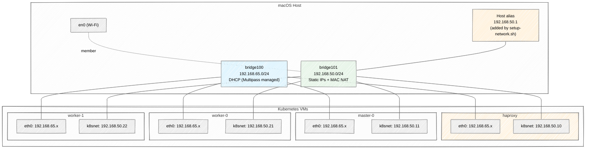

# macOS QEMU Network Configuration

This document explains the dual-NIC networking architecture used by the macOS Multipass setup with the QEMU hypervisor. This design provides stable static IP addresses for Kubernetes nodes, preventing cluster failures caused by DHCP lease changes.

## Overview

Each VM gets two network interfaces:

| Interface | Bridge | IP Assignment | Purpose |
|-----------|--------|---------------|---------|
| eth0 | bridge100 | DHCP (192.168.65.x) | Terraform SSH provisioning, Multipass management |
| k8snet | bridge101 | Static (192.168.50.x) | Kubernetes cluster communication, HAProxy |

This mirrors the Windows Hyper-V setup where VMs use a dedicated internal switch (`K8sSwitch`) for stable cluster networking.

## Network Architecture



## How It Works

### Dual Bridge Architecture

When Multipass launches a VM with `--network name=en0,mode=manual,mac=XX:XX:XX`, QEMU creates two virtual ethernet (`vmenet`) interfaces per VM:

| vmenet (even) | vmenet (odd) | VM | Bridge |
|---------------|--------------|-----|--------|
| vmenet0 | vmenet1 | haproxy | even: bridge100, odd: bridge101 |
| vmenet2 | vmenet3 | master-0 | even: bridge100, odd: bridge101 |
| vmenet4 | vmenet5 | worker-0 | even: bridge100, odd: bridge101 |
| vmenet6 | vmenet7 | worker-1 | even: bridge100, odd: bridge101 |

- **bridge100** (DHCP network): Contains even vmenet interfaces. Multipass assigns DHCP addresses (192.168.65.x). The host can always reach VMs here.
- **bridge101** (static network): Contains odd vmenet interfaces + `en0`. Uses MAC NAT mode. VMs get static IPs configured via cloud-init netplan.

### MAC NAT Mode

bridge101 uses macOS **MAC NAT** to allow VMs to appear on the physical network (en0) without requiring the router to learn new MAC addresses. VM traffic exits through en0 with MAC address translation. For host-to-VM communication on 192.168.50.x, traffic stays local on bridge101.

### Static IP Assignment

Each VM's second NIC is configured via cloud-init with a netplan file:

```yaml
# /etc/netplan/99-static.yaml (inside VM)
network:
  version: 2
  ethernets:
    eth0:
      dhcp4: true
      dhcp4-overrides:
        use-routes: false
        use-dns: false
    k8snet:
      match:
        macaddress: "52:54:00:c8:32:0a"  # unique per VM
      set-name: k8snet
      addresses:
        - 192.168.50.10/24
      nameservers:
        addresses: [8.8.8.8, 8.8.4.4]
      dhcp4: false
```

Key points:
- The `k8snet` interface is matched by **MAC address** (assigned during `multipass launch`)
- `eth0` keeps DHCP but with `use-routes: false` so the default route doesn't go through it
- DNS goes through k8snet to public DNS servers (8.8.8.8, 8.8.4.4)

### MAC Address Scheme

MAC addresses use the `52:54:00:c8:32:XX` pattern where XX is the last octet of the static IP:

| VM | Static IP | MAC Address |
|----|-----------|-------------|
| haproxy | 192.168.50.10 | 52:54:00:c8:32:0a |
| master-0 | 192.168.50.11 | 52:54:00:c8:32:0b |
| worker-0 | 192.168.50.21 | 52:54:00:c8:32:15 |
| worker-1 | 192.168.50.22 | 52:54:00:c8:32:16 |

## Setup Workflow

### Step 1: Create the Cluster

```bash
cd local-k8s/scripts/macos
terraform init
terraform apply
```

Terraform creates VMs with dual NICs, provisions Kubernetes using DHCP IPs for SSH, and configures the cluster to use static IPs internally. The helm chart installations (ingress, monitoring, ArgoCD) will fail on the first run because the host cannot yet reach the K8s API on 192.168.50.10.

### Step 2: Enable Host Connectivity

After `terraform apply` completes (or partially completes), run:

```bash
sudo ./setup-network.sh
```

This script:
1. Finds `bridge101` (the k8snet bridge with MAC NAT)
2. Adds a `192.168.50.1/24` alias to it
3. Verifies connectivity by pinging 192.168.50.10

### Step 3: Complete the Cluster Setup

Re-run terraform to install helm charts that require host-to-cluster connectivity:

```bash
terraform apply
```

> **Important:** The bridge alias added by `setup-network.sh` does **not** persist across VM restarts or macOS reboots. After restarting VMs (`multipass stop/start`) or rebooting your Mac, you must re-run:
> ```bash
> sudo ./setup-network.sh
> ```
> The Kubernetes cluster itself survives restarts — only the host-to-cluster connectivity needs to be restored.

### Step 4: Verify

```bash
export KUBECONFIG=~/.kube/config-multipass
kubectl get nodes
```

Expected output:
```
NAME       STATUS   ROLES           AGE   VERSION
master-0   Ready    control-plane   10m   v1.32.11
worker-0   Ready    <none>          8m    v1.32.11
worker-1   Ready    <none>          8m    v1.32.11
```

## Static IP Allocations

| VM | Static IP | Role |
|----|-----------|------|
| haproxy | 192.168.50.10 | Load balancer, NFS server, PostgreSQL |
| master-0 | 192.168.50.11 | Kubernetes control plane |
| worker-0 | 192.168.50.21 | Kubernetes worker node |
| worker-1 | 192.168.50.22 | Kubernetes worker node |
| Host alias | 192.168.50.1 | macOS host (on bridge101) |

## Application Access

With static IPs, applications use the same URLs as the Windows setup:

| Application | URL |
|-------------|-----|
| HAProxy Stats | http://192.168.50.10/stats |
| ArgoCD | http://argocd.192.168.50.10.nip.io |
| Grafana | http://grafana.192.168.50.10.nip.io |
| Prometheus | http://prometheus.192.168.50.10.nip.io |
| AlertManager | http://alertmanager.192.168.50.10.nip.io |

## Comparison with Other Platforms

| Feature | macOS (QEMU) | Windows (Hyper-V) | Windows (VirtualBox) |
|---------|--------------|-------------------|---------------------|
| Hypervisor | QEMU | Hyper-V | VirtualBox |
| NICs per VM | 2 (eth0 + k8snet) | 2 (eth0 + k8snet) | 2 (NAT + Host-Only) |
| Static IPs | 192.168.50.x | 192.168.50.x | 192.168.56.x |
| Host connectivity | bridge101 alias | K8sSwitch | Host-Only adapter |
| Post-terraform step | `sudo ./setup-network.sh` | `.\setup-network.ps1` (before terraform) | None (Vagrant handles it) |
| IP stability | Survives VM restarts | Survives VM restarts | Survives VM restarts |

Key difference: On Windows, `setup-network.ps1` runs **before** terraform (creates the Hyper-V switch). On macOS, `setup-network.sh` runs **after** the first `terraform apply` (because bridge101 is created by Multipass during VM launch).

## Troubleshooting

### Host Cannot Ping 192.168.50.x

1. Verify bridge101 exists and has the alias:
```bash
ifconfig bridge101 | grep "inet 192.168.50.1"
```

2. If missing, re-run:
```bash
sudo ./setup-network.sh
```

3. Check bridge101 has vmenet members:
```bash
ifconfig bridge101 | grep member
```

If no vmenet members exist, the VMs may not be running:
```bash
multipass list
```

### Bridge Alias Lost After Reboot

The bridge101 alias does not persist across macOS reboots. After rebooting:

1. Start VMs: `multipass start --all`
2. Re-run: `sudo ./setup-network.sh`

The Kubernetes cluster itself survives reboots since static IPs are configured inside the VMs via netplan.

### Terraform Helm Provider Timeout

If `terraform apply` fails with `dial tcp 192.168.50.10:6443: i/o timeout`, the host cannot reach the K8s API. Run `sudo ./setup-network.sh` first, then re-run `terraform apply`.

### Wrong Bridge Detected

If `setup-network.sh` finds the wrong bridge, you can specify bridge101 manually:
```bash
sudo ifconfig bridge101 alias 192.168.50.1 netmask 255.255.255.0
```

### Verify VM Network Configuration

Check that a VM has both interfaces:
```bash
multipass exec master-0 -- ip addr show
```

Expected output should show both `eth0` (DHCP) and `k8snet` (static 192.168.50.x).

## Technical Details

### Why Two Terraform Runs?

The macOS setup requires running `terraform apply` twice:

1. **First run**: Creates VMs with dual NICs, initializes Kubernetes, joins workers. Fails when trying to install helm charts because the host can't reach 192.168.50.10:6443 yet (bridge101 has no host alias).
2. **`sudo ./setup-network.sh`**: Adds the host alias to bridge101.
3. **Second run**: Installs remaining helm charts (ingress-nginx, NFS provisioner, monitoring, ArgoCD).

This two-step process exists because bridge101 is created by Multipass during VM launch (inside the first `terraform apply`). We cannot add the alias before the bridge exists.

### Why Not Use DHCP IPs for Everything?

DHCP IPs from bridge100 change when VMs restart or DHCP leases expire. This causes:
- Kubernetes node IPs to change, breaking cluster membership
- HAProxy config to point to wrong backend IPs
- kubeconfig to reference an invalid API server address
- NFS mounts to fail when the NFS server IP changes

Static IPs on k8snet solve all of these problems.

### Terraform SSH vs Kubernetes

Terraform uses **DHCP IPs** (from `multipass list`) for SSH provisioning. Kubernetes uses **static IPs** (192.168.50.x) for cluster communication. This separation means:
- Terraform can always reach VMs via Multipass-managed DHCP
- Kubernetes has stable addressing independent of DHCP
- The host needs the bridge101 alias only for kubectl and helm access
