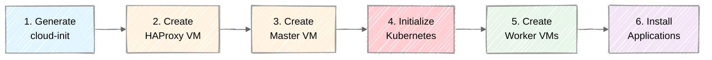

# Kubernetes Cluster Setup Guide

> **Prerequisites**
> - Basic command line familiarity (PowerShell on Windows, Terminal on macOS)
> - Administrator/sudo access on your machine
> - Stable internet connection for initial provisioning

> **Related Reading**
> - [Kubernetes Configuration Guide](k8s-conf.md) - Architecture and component details
> - [Network Configuration Guide](network-configuration.md) - Networking deep dive

---

## Learning Objectives

1. Install and configure required software dependencies (Multipass, Terraform, VirtualBox)
2. Generate SSH keys for secure VM communication
3. Configure platform-specific networking (Hyper-V or VirtualBox on Windows)
4. Provision a local Kubernetes cluster using Terraform
5. Verify cluster health and access the Kubernetes API
6. Access pre-installed applications (ArgoCD, Grafana, Prometheus)

---

## 1. Hardware Requirements

Before starting, verify your machine meets these minimum specifications.

### 1.1 Minimum Requirements

| Resource | Minimum | Recommended |
|----------|---------|-------------|
| RAM | 12 GB | 16+ GB |
| CPU Cores | 4 | 6+ |
| Free Disk | 50 GB | 100 GB |
| OS (Windows) | Windows 10/11 (any edition) | Windows 11 Pro |
| OS (macOS) | macOS 10.15 Catalina | macOS 12 Monterey+ |

> **Note:** Windows Home edition does not support Hyper-V but can use VirtualBox instead. See [Section 4.2](#42-windows-home-virtualbox-setup).

### 1.2 Resource Allocation

The default cluster configuration allocates these resources:

| VM | CPU | Memory | Disk |
|----|-----|--------|------|
| HAProxy | 2 | 4 GB | 30 GB |
| Master-0 | 2 | 4 GB | 10 GB |
| Worker-0 | 3 | 3 GB | 15 GB |
| Worker-1 | 3 | 3 GB | 15 GB |
| **Total** | **10** | **14 GB** | **70 GB** |

---

## 2. Software Installation

Install the required tools before proceeding.

### 2.1 Install Multipass

**Multipass** is a lightweight VM manager that creates Ubuntu virtual machines.

**Windows:**
1. Download from https://multipass.run/download/windows
2. Run the installer (requires restart)
3. Verify installation:
```powershell
multipass version
```

**macOS:**
```bash
brew install --cask multipass
multipass version
```

### 2.2 Install Terraform

**Terraform** orchestrates the cluster provisioning.

**Windows:**
1. Download from https://developer.hashicorp.com/terraform/downloads
2. Extract to a directory (e.g., `C:\tools\terraform`)
3. Add to PATH environment variable
4. Verify installation:
```powershell
terraform version
```

**macOS:**
```bash
brew tap hashicorp/tap
brew install hashicorp/tap/terraform
terraform version
```

### 2.3 Install VirtualBox and Vagrant (Windows Home Only)

Windows Home users must install VirtualBox and Vagrant since Hyper-V is not available.

**VirtualBox:**
1. Download VirtualBox 7.0+ from https://www.virtualbox.org/wiki/Downloads
2. Run the installer with default options
3. Restart if prompted
4. Verify:
```powershell
& "C:\Program Files\Oracle\VirtualBox\VBoxManage.exe" --version
```

**Vagrant:**
1. Download from https://developer.hashicorp.com/vagrant/downloads
2. Run the installer
3. Restart your terminal
4. Verify:
```powershell
vagrant --version
```

> **Note:** Windows Pro/Enterprise/Education users should skip this and use Hyper-V instead. See [VirtualBox + Vagrant Setup](virtualbox-vagrant-setup.md) for detailed instructions.

### 2.4 Install kubectl (Optional but Recommended)

**kubectl** is the Kubernetes command-line tool.

**Windows:**
```powershell
# Using Chocolatey
choco install kubernetes-cli

# Or download directly
curl.exe -LO "https://dl.k8s.io/release/v1.32.0/bin/windows/amd64/kubectl.exe"
```

**macOS:**
```bash
brew install kubectl
```

---

## 3. SSH Key Configuration

Terraform uses SSH to connect to VMs during provisioning.

### 3.1 Generate SSH Keys

**Windows (PowerShell):**
```powershell
# Navigate to SSH directory
cd $env:USERPROFILE\.ssh

# Generate key pair (press Enter for all prompts)
ssh-keygen -t rsa -b 4096 -f kse_ci_cd_sec_id_rsa -N '""'

# Verify files exist
dir kse_ci_cd_sec_id_rsa*
```

**macOS/Linux:**
```bash
# Navigate to SSH directory
cd ~/.ssh

# Generate key pair
ssh-keygen -t rsa -b 4096 -f kse_ci_cd_sec_id_rsa -N ""

# Verify files exist
ls -la kse_ci_cd_sec_id_rsa*
```

### 3.2 Expected Files

After generation, you should have two files:

| File | Purpose |
|------|---------|
| `kse_ci_cd_sec_id_rsa` | Private key (keep secure, never share) |
| `kse_ci_cd_sec_id_rsa.pub` | Public key (copied to VMs) |

> **Security Note:** The private key should have restricted permissions. On Unix systems, run `chmod 600 kse_ci_cd_sec_id_rsa`.

---

## 4. Platform-Specific Setup

### 4.1 Windows: Hyper-V and Network Configuration

Windows requires additional setup for the virtual network.

#### 4.1.1 Enable Hyper-V

Run PowerShell as Administrator:
```powershell
# Enable Hyper-V
Enable-WindowsOptionalFeature -Online -FeatureName Microsoft-Hyper-V -All

# Restart when prompted
Restart-Computer
```

After restart, verify Hyper-V is enabled:
```powershell
Get-WindowsOptionalFeature -Online -FeatureName Microsoft-Hyper-V
# State should be "Enabled"
```

#### 4.1.2 Create Virtual Network

The setup script creates a Hyper-V internal switch with NAT for internet access.

```powershell
# Navigate to scripts directory
cd local-k8s\scripts\windows

# Run as Administrator
.\setup-network.ps1
```

Expected output:
```
Setting up Hyper-V network for Kubernetes cluster...
Checking VMSwitch 'K8sSwitch'...
  Creating Internal VMSwitch: K8sSwitch
Checking IP configuration...
  Assigning IP 192.168.50.1/24 to interface
Checking NAT configuration...
  Creating NAT: K8sNAT for subnet 192.168.50.0/24

Network setup complete!
```

#### 4.1.3 Verify Network Setup

```powershell
# Check switch exists
Get-VMSwitch -Name "K8sSwitch"

# Check IP assignment
Get-NetIPAddress -InterfaceAlias "*K8sSwitch*" | Select IPAddress

# Check NAT
Get-NetNat -Name "K8sNAT"
```

### 4.2 Windows Home: VirtualBox + Vagrant Setup

Windows Home users cannot use Hyper-V. The VirtualBox setup uses **Vagrant** to create and provision VMs instead of Multipass. Vagrant provides full control over VirtualBox VM configuration, including dual network adapters and static IP assignment.

> **Detailed Guide:** See [VirtualBox + Vagrant Setup](virtualbox-vagrant-setup.md) for the complete walkthrough including architecture, troubleshooting, and comparison with Hyper-V.

#### 4.2.1 Dual-NIC Architecture

Each VirtualBox VM has two network adapters:

| Adapter | Interface | Purpose | IP |
|---------|-----------|---------|-----|
| Adapter 1 | enp0s3 (NAT) | Internet access | 10.0.2.15 (DHCP) |
| Adapter 2 | enp0s8 (Host-Only) | Cluster communication | 192.168.56.x (static) |

Both Hyper-V and VirtualBox use dual NICs, but they differ in default route configuration. In Hyper-V, cloud-init sets the default route through the K8s network interface (`k8snet`), so kubelet automatically selects the correct IP. In VirtualBox, the default route goes through the NAT interface (`enp0s3`), so kubelet requires an explicit `--node-ip` flag to use the Host-Only IP. The Vagrantfile handles this automatically.

#### 4.2.2 Verify Host-Only Network

Before creating the cluster, verify the Host-Only adapter exists:

```powershell
& "C:\Program Files\Oracle\VirtualBox\VBoxManage.exe" list hostonlyifs
```

Look for an adapter with `IPAddress: 192.168.56.1`. If none exists, create one:

```powershell
& "C:\Program Files\Oracle\VirtualBox\VBoxManage.exe" hostonlyif create
& "C:\Program Files\Oracle\VirtualBox\VBoxManage.exe" hostonlyif ipconfig "VirtualBox Host-Only Ethernet Adapter" --ip 192.168.56.1 --netmask 255.255.255.0
```

Verify connectivity:
```powershell
ping 192.168.56.1
```

#### 4.2.3 Deploy the Cluster

The VirtualBox setup uses a single script that runs both Vagrant (VM creation) and Terraform (application deployment):

```powershell
cd local-k8s\scripts\virtual-box
.\create-cluster.cmd
```

This creates VMs sequentially (haproxy, master-0, worker-0, worker-1), then runs Terraform to deploy applications.

> **Duration:** 30-60 minutes depending on internet speed and hardware.

#### 4.2.4 IP Address Map

| VM | Host-Only IP | Role |
|----|-------------|------|
| haproxy | 192.168.56.10 | Load balancer for K8s API, HTTP, HTTPS |
| master-0 | 192.168.56.11 | Kubernetes control plane |
| worker-0 | 192.168.56.21 | Kubernetes worker node |
| worker-1 | 192.168.56.22 | Kubernetes worker node |

> **Important:** The VirtualBox setup uses subnet `192.168.56.x` and kubeconfig file `~/.kube/config-virtualbox`, different from the Hyper-V setup (`192.168.50.x` and `~/.kube/config-multipass`).

---

### 4.3 macOS: Post-Terraform Network Setup

macOS uses dual-NIC VMs with static IPs. The network bridge (bridge101) is created by Multipass during VM launch, so `setup-network.sh` must run **after** the first `terraform apply`.

Verify Multipass is running:
```bash
multipass version
multipass list  # Should show "No instances found" initially
```

> **Note:** After the first `terraform apply`, you will need to run `sudo ./setup-network.sh` to enable host connectivity to static IPs, then re-run `terraform apply`. See [macOS QEMU Network Configuration](macos-qemu-networking.md) for details.

---

## 5. Cluster Provisioning

### 5.1 Navigate to Platform Directory

**Windows (Hyper-V - Pro/Enterprise/Education):**
```powershell
cd local-k8s\scripts\windows
```

**Windows (VirtualBox - Home edition):**
```powershell
cd local-k8s\scripts\virtual-box
```

**macOS:**
```bash
cd local-k8s/scripts/macos
```

### 5.2 Deploy the Cluster

**Windows (VirtualBox)** - Use the automated script that runs Vagrant and Terraform:
```powershell
.\create-cluster.cmd
```

**All other platforms** - Use Terraform directly:

Initialize Terraform (download required providers):
```bash
terraform init
```

Review what Terraform will create (optional):
```bash
terraform plan
```

Create the cluster:
```bash
terraform apply
```

When prompted, type `yes` to confirm.

**macOS only** — after the first `terraform apply`, enable host connectivity and re-run:
```bash
sudo ./setup-network.sh
terraform apply
```

> **Important (macOS):** The bridge alias does **not** persist across VM restarts or macOS reboots. After restarting VMs or rebooting your Mac, re-run `sudo ./setup-network.sh` to restore host connectivity to the cluster.

> **Duration:** Initial provisioning takes 15-30 minutes (Hyper-V/macOS) or 30-60 minutes (VirtualBox).

### 5.5 Provisioning Stages

The provisioning follows this sequence:



---

## 6. Cluster Verification

### 6.1 Set KUBECONFIG

**Windows (Hyper-V):**
```powershell
$env:KUBECONFIG = "$env:USERPROFILE\.kube\config-multipass"
```

**Windows (VirtualBox):**
```powershell
$env:KUBECONFIG = "$env:USERPROFILE\.kube\config-virtualbox"
```

**macOS:**
```bash
export KUBECONFIG=~/.kube/config-multipass
```

> **Tip:** Add this to your shell profile (`.bashrc`, `.zshrc`, or PowerShell profile) for persistence.

### 6.2 Verify Nodes

```bash
kubectl get nodes
```

Expected output:
```
NAME       STATUS   ROLES           AGE   VERSION
master-0   Ready    control-plane   10m   v1.32.11
worker-0   Ready    <none>          8m    v1.32.11
worker-1   Ready    <none>          8m    v1.32.11
```

All nodes should show `Ready` status.

### 6.3 Verify System Pods

```bash
kubectl get pods -A
```

All pods should be `Running` or `Completed`:

| Namespace | Key Pods |
|-----------|----------|
| kube-system | coredns, etcd, kube-apiserver, kube-proxy, weave-net |
| ingress-nginx | ingress-nginx-controller |
| argocd | argocd-server, argocd-repo-server |
| monitoring | prometheus, grafana, alertmanager |

### 6.4 Verify Cluster Info

```bash
kubectl cluster-info
```

Expected output (Windows):
```
Kubernetes control plane is running at https://192.168.50.10:6443
CoreDNS is running at https://192.168.50.10:6443/api/v1/namespaces/kube-system/services/kube-dns:dns/proxy
```

---

## 7. Accessing Applications

The cluster includes pre-installed applications accessible via `http://<app>.<HAPROXY_IP>.nip.io`. The HAProxy IP depends on your setup: `192.168.50.10` (Hyper-V / macOS) or `192.168.56.10` (VirtualBox).

| Application | URL pattern | Default Credentials |
|-------------|-------------|---------------------|
| HAProxy Stats | `http://<HAPROXY_IP>/stats` | hapuser / password!1234 |
| ArgoCD | `http://argocd.<HAPROXY_IP>.nip.io` | admin / (see below) |
| Grafana | `http://grafana.<HAPROXY_IP>.nip.io` | admin / admin |
| Prometheus | `http://prometheus.<HAPROXY_IP>.nip.io` | — |
| AlertManager | `http://alertmanager.<HAPROXY_IP>.nip.io` | — |

Retrieve the ArgoCD admin password:
```bash
kubectl -n argocd get secret argocd-initial-admin-secret -o jsonpath='{.data.password}' | base64 -d
```

> **macOS:** Run `sudo ./setup-network.sh` after `terraform apply` to enable host access to the cluster IPs.

---

## 8. Common Configuration Changes

### 8.1 Change Number of Workers

Edit `variables.tf`:
```hcl
variable "workers" {
  default = 3  # Change from 2 to 3
}
```

Then apply:
```bash
terraform apply
```

### 8.2 Change Kubernetes Version

Edit `variables.tf`:
```hcl
variable "kube_version" {
  default = "1.32.11-1.1"  # Update version
}

variable "kube_minor_version" {
  default = "1.32"  # Update minor version
}
```

> **Warning:** Changing Kubernetes version on an existing cluster requires a full rebuild with `terraform destroy` first.

### 8.3 Change Resource Allocation

Edit `variables.tf` to adjust memory or CPU:
```hcl
variable "worker_mem" {
  default = "4G"  # Increase from 3G
}

variable "worker_cpu" {
  default = 4  # Increase from 3
}
```

---

## 9. Cleanup and Reset

### 9.1 Destroy Cluster

Remove all VMs and resources:
```bash
terraform destroy
```

Type `yes` when prompted.

### 9.2 Full Reset

If you encounter issues, perform a complete reset:

**Windows (Hyper-V):**
```powershell
cd local-k8s\scripts\windows

# Destroy Terraform resources
terraform destroy -auto-approve

# Run reset script
.\reset.ps1

# Purge Multipass VMs
multipass delete --all --purge
```

**Windows (VirtualBox):**
```powershell
cd local-k8s\scripts\virtual-box

# Use the destroy script (runs Terraform destroy + Vagrant destroy)
.\destroy-cluster.cmd

# Or manually:
terraform destroy -auto-approve
vagrant destroy -f
```

**macOS:**
```bash
cd local-k8s/scripts/macos

# Destroy Terraform resources
terraform destroy -auto-approve

# Run reset script
./reset.sh

# Purge Multipass VMs
multipass delete --all --purge
```

---

## 10. Troubleshooting

### 10.1 Terraform Fails During VM Creation

**Symptom:** Error during `terraform apply` mentioning VM creation failure.

**Solution:**
1. Check Multipass status: `multipass list`
2. Check available resources: Ensure sufficient RAM and disk
3. Reset and retry:
```bash
multipass delete --all --purge
terraform apply
```

### 10.2 Nodes Not Ready

**Symptom:** `kubectl get nodes` shows `NotReady` status.

**Diagnosis:**
```bash
# Check node conditions
kubectl describe node <node-name>

# Check kubelet logs
multipass exec master-0 -- journalctl -u kubelet -f
```

**Common causes:**
- CNI plugin not installed (check weave-net pods)
- Network connectivity issues
- Insufficient resources

### 10.3 Cannot Access Applications

**Symptom:** Browser cannot reach application URLs.

**Windows - Check connectivity:**
```powershell
# Ping HAProxy
ping 192.168.50.10

# Check if ports are listening
Test-NetConnection -ComputerName 192.168.50.10 -Port 80
```

**macOS - Check connectivity:**
```bash
# Ping HAProxy static IP
ping 192.168.50.10

# If ping fails, ensure setup-network.sh was run
sudo ./setup-network.sh
```

### 10.4 SSH Connection Refused

**Symptom:** Terraform fails with SSH connection errors.

**Solution:**
1. Verify SSH key exists:
```bash
# Windows
dir $env:USERPROFILE\.ssh\kse_ci_cd_sec_id_rsa

# macOS
ls -la ~/.ssh/kse_ci_cd_sec_id_rsa
```

2. Check key permissions (macOS/Linux):
```bash
chmod 600 ~/.ssh/kse_ci_cd_sec_id_rsa
```

3. Test SSH manually:
```bash
# Windows
ssh -i $env:USERPROFILE\.ssh\kse_ci_cd_sec_id_rsa root@192.168.50.10

# macOS
ssh -i ~/.ssh/kse_ci_cd_sec_id_rsa root@<haproxy-ip>
```

### 10.5 View Provisioning Logs

Check cloud-init output for debugging VM setup:
```bash
multipass exec master-0 -- cat /var/log/cloud-init-output.log
```

### 10.6 VirtualBox-Specific Issues

> **Detailed Troubleshooting:** See [VirtualBox + Vagrant Setup - Section 8](virtualbox-vagrant-setup.md#8-troubleshooting) for a complete troubleshooting guide.

**Symptom:** VM boot timeout

**Solution:** If a VM is stuck, try:
```powershell
cd local-k8s\scripts\virtual-box
vagrant destroy <vm-name> -f
vagrant up <vm-name>
```

**Symptom:** Nodes show wrong INTERNAL-IP (10.0.2.15)

**Cause:** Kubelet did not receive the `--node-ip` flag. The Vagrantfile writes this to `/etc/default/kubelet` during provisioning.

**Fix on the affected node:**
```bash
sudo bash -c 'NODE_IP=$(ip -4 addr show enp0s8 | awk "/inet / {split(\$2, a, \"/\"); print a[1]}"); echo "KUBELET_EXTRA_ARGS=--node-ip=$NODE_IP" > /etc/default/kubelet; systemctl daemon-reload; systemctl restart kubelet'
```

**Symptom:** Host-Only network adapter not found

**Solution:**
```powershell
& "C:\Program Files\Oracle\VirtualBox\VBoxManage.exe" hostonlyif create
& "C:\Program Files\Oracle\VirtualBox\VBoxManage.exe" hostonlyif ipconfig "VirtualBox Host-Only Ethernet Adapter" --ip 192.168.56.1 --netmask 255.255.255.0
```

**Symptom:** Workers cannot join cluster

**Diagnosis:** SSH into the worker and test connectivity:
```powershell
vagrant ssh worker-0
curl -k https://192.168.56.11:6443/healthz   # Direct to master
curl -k https://192.168.56.10:6443/healthz   # Through HAProxy
```

---

## Summary and Key Concepts

This guide covered the complete process of setting up a local Kubernetes cluster:

1. **Prerequisites** - Hardware requirements (14 GB RAM, 70 GB disk) and software dependencies
2. **SSH Keys** - Required for secure Terraform-to-VM communication
3. **Platform Setup**:
   - Windows Pro/Enterprise/Education: Hyper-V with K8sSwitch, Multipass for VMs (192.168.50.x)
   - Windows Home: VirtualBox with Vagrant for VMs, dual NICs - NAT + Host-Only (192.168.56.x)
   - macOS: Dual-NIC VMs with QEMU, static IPs on bridge101 (192.168.50.x)
4. **Provisioning** - `create-cluster.cmd` (VirtualBox) or `terraform apply` (Hyper-V/macOS) creates the cluster
5. **Verification** - Use `kubectl get nodes` and `kubectl get pods -A` to confirm health
6. **Applications** - Pre-installed tools accessible via nip.io DNS names

---

## Review Questions

1. Why does Windows require a Hyper-V virtual switch while macOS does not?
2. What is the purpose of the HAProxy VM in this cluster architecture?
3. Why are SSH keys required for Terraform provisioning?
4. How would you add a third worker node to the cluster?
5. What command verifies that all Kubernetes nodes are healthy?

---

## References

### Official Documentation
- Kubernetes Documentation: https://kubernetes.io/docs/
- Terraform Documentation: https://developer.hashicorp.com/terraform/docs
- Multipass Documentation: https://multipass.run/docs

### Project Documentation
- [Kubernetes Configuration Guide](k8s-conf.md)
- [Network Configuration Guide](network-configuration.md)
- [macOS QEMU Network Configuration](macos-qemu-networking.md)
- [VirtualBox + Vagrant Setup](virtualbox-vagrant-setup.md)

### Tools
- kubeadm: https://kubernetes.io/docs/reference/setup-tools/kubeadm/
- Weave Net CNI: https://www.weave.works/docs/net/latest/overview/
- HAProxy: https://www.haproxy.org/
- Vagrant: https://developer.hashicorp.com/vagrant/docs
- VirtualBox: https://www.virtualbox.org/manual/

---

## Related Course Materials

- [Kubernetes Configuration Guide](k8s-conf.md) - Deep dive into cluster architecture
- [Network Configuration Guide](network-configuration.md) - Networking details and troubleshooting
- [macOS QEMU Network Configuration](macos-qemu-networking.md) - macOS dual-bridge architecture
- [VirtualBox + Vagrant Setup](virtualbox-vagrant-setup.md) - Windows Home edition setup
