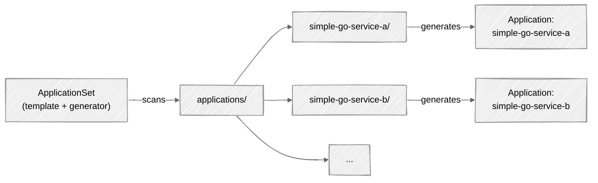

## GitHub Organization Creation

A GitHub account is required before proceeding. Create a new organization at [github.com/organizations/plan](https://github.com/organizations/plan) with a unique name, for example `kse-<your_unique_id>`. Start with the **Free** plan — you can upgrade later.

In later labs you will need to upgrade to the **Team** plan (a free trial is available). The Free plan does not include the security features used in this course. See [github.com/security/plans](https://github.com/security/plans) for a full comparison.

### Fork the course repositories

Create fork of the following repositories in your organization:
```bash
https://github.com/kse-bd8338bbe006/lab-env-setup.git
https://github.com/kse-bd8338bbe006/kse-labs-deployment.git
https://github.com/kse-bd8338bbe006/kse-labs-trusted-workflows.git
https://github.com/kse-bd8338bbe006/simple-go-service-a.git
```

Make all repos public so they are accessible to the instructor.
From now on, you will work with the forked repositories independently. These repositories will be used for all labs instead of the originals in `kse-bd8338bbe006`. This allows you to make changes, configure settings, and experiment freely without affecting the course source repositories.

Fill in the [table](https://docs.google.com/spreadsheets/d/10uZwVNxqzDPoXXrlHGP_1yV-OhnfRr5ENmOwVM33M70/edit?usp=sharing) so that the organization name and the student it belongs to are known.

### Prerequisites

Install the required tools before proceeding. The exact set depends on your OS.

| Tool | Required | macOS | Windows |
|------|----------|-------|---------|
| **Git** | All | `brew install git` | [git-scm.com/downloads](https://git-scm.com/downloads/win) |
| **Multipass** | macOS, Windows Pro/Ent/Edu | `brew install --cask multipass` | [multipass.run/download/windows](https://multipass.run/download/windows) |
| **Terraform** | All | `brew tap hashicorp/tap && brew install hashicorp/tap/terraform` | [developer.hashicorp.com/terraform/downloads](https://developer.hashicorp.com/terraform/downloads) |
| **kubectl** | All (recommended) | `brew install kubectl` | `choco install kubernetes-cli` or [direct download](https://dl.k8s.io/release/v1.32.0/bin/windows/amd64/kubectl.exe) |
| **VirtualBox** | Windows Home only | — | [virtualbox.org/wiki/Downloads](https://www.virtualbox.org/wiki/Downloads) |
| **Vagrant** | Windows Home only | — | [developer.hashicorp.com/vagrant/downloads](https://developer.hashicorp.com/vagrant/downloads) |

You also need to generate an SSH key pair that Terraform will use to connect to the VMs:

```bash
# macOS / Linux
ssh-keygen -t rsa -b 4096 -f ~/.ssh/kse_ci_cd_sec_id_rsa -N ""

# Windows (PowerShell)
ssh-keygen -t rsa -b 4096 -f $env:USERPROFILE\.ssh\kse_ci_cd_sec_id_rsa -N '""'
```

Verify each tool is installed by running its version command (e.g. `terraform version`, `multipass version`, `kubectl version --client`).

### Setup K8s

Clone your fork of the lab environment repository:
```bash
git clone https://github.com/<your-org>/lab-env-setup.git
```

Based on your OS, follow the corresponding setup:

| OS | Virtualization | Setup |
|----|---------------|-------|
| **macOS** | Multipass (QEMU) | `cd lab-env-setup/local-k8s/scripts/macos && terraform init && terraform apply` |
| **Windows Pro/Enterprise/Education** | Multipass (Hyper-V) | `cd lab-env-setup\local-k8s\scripts\windows` then run `setup-network.ps1`, `terraform init`, `terraform apply` |
| **Windows Home** | VirtualBox + Vagrant | `cd lab-env-setup\local-k8s\scripts\virtual-box` then run `.\create-cluster.cmd` |

**macOS only:** After the first `terraform apply`, run `sudo ./setup-network.sh` to enable host connectivity to the cluster IPs, then re-run `terraform apply`.

See [Setup Guide](setup-guide.md) for detailed step-by-step instructions.


### kubeconfig configuration
```bash
cp config-multipass config
```
or use export:
```bash
export KUBECONFIG=$(pwd)/config-multipass
```


### Configure ArgoCD

Retrieve the initial admin password:
```bash
kubectl -n argocd get secret argocd-initial-admin-secret -o jsonpath="{.data.password}" | base64 -d
```

Open the ArgoCD UI in your browser (e.g. `http://argocd.192.168.50.10.nip.io`) and log in with:
- **Username:** `admin`
- **Password:** the value from the command above

The cluster uses two ArgoCD projects — `infra` and `applications` — which are automatically created by the bootstrap pattern (see [Deploy via bootstrap](#deploy-via-bootstrap)). You do not need to create them manually.

ArgoCD **Projects** provide logical grouping of applications and are important from a security perspective. Each project defines a set of allowed Kubernetes resources (via RBAC) that applications within it can create. This enforces least-privilege access per project:

- **`infra`** project — for applications that require elevated permissions such as admission controller webhooks, CRDs, ClusterRoles, and namespace-level policies (e.g., OPA Gatekeeper, Falco, Fluent Bit)
- **`applications`** project — regular microservices only need a limited set of permissions (can be extended later):
  - Deployments
  - Services
  - Ingresses
  - Secrets
  - ConfigMaps

Projects are especially useful in multi-team environments where multiple teams deploy to the same cluster. By combining Kubernetes namespaces, RBAC, and ArgoCD project configurations, you can enforce the **least-privilege principle** — each team can only deploy to their own namespaces and create only the resource types they need.


Project roles define permissions that restrict what resources can be created, patched, or deleted based on Kubernetes RBAC and the synced code. You can also grant a CI system specific access to project applications via JWT, or grant OIDC groups access to project applications.

> **Recommendation:** Do not use the `default` project that ArgoCD creates out of the box — always create your own.


### Repository configuration
Go to settings / repo 
http://argocd.192.168.50.10.nip.io/settings/repos
and click on "connect repo"

Select HTTPS and connect the repo using:
- **Type:** git
- **Project:** leave empty (credentials will be available to all projects)
- **Repository URL:** `https://github.com/<your-org>/kse-labs-deployment.git`
- **Username:** `x-access-token`
- **Password:** a GitHub **Fine-grained Personal Access Token**. To generate one:
  1. Go to GitHub → **Settings** → **Developer settings** → **Personal access tokens** → **Fine-grained tokens**
  2. Click **Generate new token**
  3. Give it a descriptive name (e.g. `argocd-repo-access`)
  4. Set **Resource owner** to your organization name
  5. Under **Repository access**, select **All repositories**
  6. Under **Permissions** → **Repository permissions**, set **Contents** to **Read-only**
  7. Click **Generate token** and copy the value
  8. Paste it as the password in ArgoCD

You should see Connection Status = successfull


Or use the ArgoCD CLI:
```bash
brew install argocd
argocd login argocd.192.168.50.10.nip.io:80 --username admin --password $(kubectl -n argocd get secret argocd-initial-admin-secret -o jsonpath="{.data.password}" | base64 -d) --insecure --grpc-web
```
You should see output like:
```
WARNING: server is not configured with TLS. Proceed (y/n)? y
'admin:login' logged in successfully
Context 'argocd.192.168.50.10.nip.io:80' updated
```

To connect the repository via CLI:
```bash
argocd repo add https://github.com/<your-org>/kse-labs-deployment.git \
  --username x-access-token \
  --password <your-fine-grained-token> \
  --grpc-web
```

### ApplicationSets

An ArgoCD **Application** is a single resource that maps one Git path to one Kubernetes namespace. If you have 10 services, you would need to create and maintain 10 Application manifests manually — each with its own repo URL, path, destination namespace, and sync policy. Adding a new service means writing another YAML file and applying it.

An **ApplicationSet** solves this by generating Applications automatically from a template. Instead of defining each Application by hand, you define a pattern once and ArgoCD creates Applications for every match.

In this lab, the `applications` ApplicationSet uses a **Git directory generator** — it scans a directory in the deployment repo and creates one Application per subdirectory:

```yaml
generators:
  - git:
      repoURL: https://github.com/<your-org>/kse-labs-deployment.git
      directories:
        - path: applications/*
```



To deploy a new service, you simply add a new subdirectory with its Kubernetes manifests — the ApplicationSet detects it and creates the corresponding Application automatically. No manual ArgoCD configuration is needed.

The same pattern is used for the `infra` ApplicationSet, which scans `infra/*` for infrastructure components.

### Deploy via bootstrap

The deployment repo uses a **bootstrap pattern** — a single ArgoCD Application that recursively syncs the `argocd/` directory, which contains all AppProjects and ApplicationSets. These in turn create the actual applications.

```
bootstrap.yaml (applies manually)
  └── argocd/
      ├── projects/
      │   ├── applications-project.yaml   (AppProject: applications)
      │   └── infra-project.yaml          (AppProject: infra)
      └── applicationsets/
          ├── applications.yaml           (ApplicationSet: scans applications/*)
          └── infra.yaml                  (ApplicationSet: scans infra/*)
```

The bootstrap app itself needs a dedicated project with minimal permissions. Apply it in two steps:

**Step 1:** Create the bootstrap project (solves the chicken-and-egg problem):
```bash
cd kse-labs-deployment
kubectl apply -f bootstrap-project.yaml
```

This creates a `bootstrap` AppProject that can **only** create AppProjects and ApplicationSets in the `argocd` namespace — nothing else.

**Step 2:** Apply the bootstrap application:
```bash
kubectl apply -f bootstrap.yaml
```

ArgoCD will now:
1. Sync `argocd/projects/` → create `infra` and `applications` AppProjects
2. Sync `argocd/applicationsets/` → create ApplicationSets that scan `infra/*` and `applications/*` directories
3. ApplicationSets auto-generate Applications for each subdirectory (e.g. `applications/simple-go-service-a`)

**Important:** Before pushing to your org, replace `kse-bd8338bbe006` with your organization name in all YAML files:
```bash
cd kse-labs-deployment
grep -rl "kse-bd8338bbe006" . | xargs sed -i '' 's/kse-bd8338bbe006/<your-org>/g'
git add -A && git commit -m "Update org name" && git push
```

### Configure container registry pull secret

Application images are stored in GitHub Container Registry (GHCR), which is private by default. Kubernetes needs credentials to pull images.

When a Pod is scheduled, kubelet instructs the container runtime (containerd) to pull the specified image. If the registry requires authentication, containerd needs credentials. Kubernetes handles this through `imagePullSecrets` — a Pod-level field that references a Secret of type `kubernetes.io/dockerconfigjson`. Kubelet reads the secret and passes the credentials to containerd, which uses them to authenticate against the registry.

The deployment manifests in this lab reference an `imagePullSecret` named `ghcr-pull-secret`:

```yaml
spec:
  imagePullSecrets:
    - name: ghcr-pull-secret
  containers:
    - name: app
      image: ghcr.io/<your-org>/simple-go-service-a:latest
```


**Step 1:** Create a GitHub token with package read access. You can reuse your existing fine-grained token if you add the **`packages:read`** permission, or create a classic token with the `read:packages` scope.

**Step 2:** Create the secret in each application namespace:
```bash
kubectl create secret docker-registry ghcr-pull-secret \
  -n applications \
  --docker-server=ghcr.io \
  --docker-username=x-access-token \
  --docker-password=<your-github-token>
```

> **Note:** The namespace must exist before creating the secret. ArgoCD creates it automatically via `CreateNamespace=true` in the ApplicationSet sync policy, so run this command **after** the bootstrap has synced.

For multiple services, repeat for each namespace or use a script:
```bash
TOKEN=<your-github-token>
for NS in applications; do
  kubectl create secret docker-registry ghcr-pull-secret \
    -n "$NS" \
    --docker-server=ghcr.io \
    --docker-username=x-access-token \
    --docker-password="$TOKEN"
done
```

#### Secret management with Vault + ESO

Manually creating secrets via `kubectl` works for initial setup, but doesn't scale and isn't GitOps-friendly. The lab cluster comes with **HashiCorp Vault** and **External Secrets Operator (ESO)** pre-installed via Terraform.

**How it works:**
- **Vault** runs as a standalone server inside the cluster with **persistent file storage** (NFS-backed PVC). Secrets survive pod restarts. Terraform automatically initializes, unseals, and configures Vault during provisioning.
- **ESO** is a Kubernetes operator that watches for `ExternalSecret` resources and fetches secrets from Vault, creating standard Kubernetes `Secret` objects automatically.

**Accessing Vault:**

Retrieve the root token:
```bash
kubectl -n vault get secret vault-unseal-key -o jsonpath='{.data.root-token}' | base64 -d
```

Access Vault UI at `http://vault.<haproxy-ip>.nip.io` and log in with the token above.

> **Auto-unseal:** The Vault pod has a `postStart` lifecycle hook that automatically unseals Vault on restart using the unseal key stored in the `vault-unseal-key` Kubernetes secret. No manual intervention is needed after pod restarts.

The deployment repo already contains an `ExternalSecret` manifest at `applications/simple-go-service-a/ghcr-pull-secret.yaml` that references Vault. You only need to store the actual credentials in Vault:

```bash
# Get the root token
ROOT_TOKEN=$(kubectl -n vault get secret vault-unseal-key -o jsonpath='{.data.root-token}' | base64 -d)

# Store the GHCR credentials in Vault
kubectl exec -n vault vault-0 -- sh -c "VAULT_TOKEN=$ROOT_TOKEN vault kv put secret/github/ghcr-pull-secret \
  docker-server=ghcr.io \
  docker-username=x-access-token \
  docker-password=<your-github-token>"
```

Once ArgoCD syncs the `ExternalSecret`, ESO fetches the credentials from Vault and creates the `ghcr-pull-secret` Kubernetes Secret automatically.

The `ExternalSecret` in the repo looks like this:

```yaml
# applications/simple-go-service-a/ghcr-pull-secret.yaml
apiVersion: external-secrets.io/v1beta1
kind: ExternalSecret
metadata:
  name: ghcr-pull-secret
  namespace: applications
spec:
  refreshInterval: 1h
  secretStoreRef:
    name: vault-backend
    kind: ClusterSecretStore
  target:
    name: ghcr-pull-secret
    template:
      type: kubernetes.io/dockerconfigjson
      data:
        .dockerconfigjson: |
          {"auths":{"{{ .dockerServer }}":{"username":"{{ .dockerUsername }}","password":"{{ .dockerPassword }}"}}}
  data:
    - secretKey: dockerServer
      remoteRef:
        key: secret/data/github/ghcr-pull-secret
        property: docker-server
    - secretKey: dockerUsername
      remoteRef:
        key: secret/data/github/ghcr-pull-secret
        property: docker-username
    - secretKey: dockerPassword
      remoteRef:
        key: secret/data/github/ghcr-pull-secret
        property: docker-password
```

> **Why this is better:** secrets never appear in Git (not even encrypted). The `ExternalSecret` only contains a *reference* to where the secret lives in Vault. The actual credentials exist only in Vault and in the auto-generated Kubernetes Secret.

For more details on the architecture and the difference between ESO and Vault Agent Injector, see [Vault + ESO Architecture](vault-eso-architecture.md).

### Create GitHub token to pull images from GHCR

The last step is to create a GitHub PAT with **Packages: Read** permission and store it in Vault. This token will be used to authenticate against the GitHub Container Registry (ghcr.io).

1. Go to **Settings** → **Developer settings** → **Personal access tokens** → **Tokens (classic)**
2. Click **Generate new token (classic)**
3. Name it `ghcr-pull` and select the `read:packages` scope
4. Click **Generate token** and copy the value


Store the token in Vault:

```bash
# Get the root token
ROOT_TOKEN=$(kubectl -n vault get secret vault-unseal-key -o jsonpath='{.data.root-token}' | base64 -d)

# Store credentials in Vault
kubectl exec -n vault vault-0 -- sh -c "VAULT_TOKEN=$ROOT_TOKEN vault kv put secret/github/ghcr-pull-secret \
  docker-server=ghcr.io \
  docker-username=x-access-token \
  docker-password=ghp_yourTokenHere"
```

You should see a response like:

```
======== Secret Path ========
secret/data/github/ghcr-pull-secret

======= Metadata =======
Key                Value
---                -----
created_time       2026-02-14T07:56:27.840465062Z
custom_metadata    <nil>
deletion_time      n/a
destroyed          false
version            1
```

Once stored, the token is automatically picked up by the full chain described earlier: ESO fetches the credentials from Vault and creates the `ghcr-pull-secret` Kubernetes Secret. ArgoCD syncs the deployment manifests that reference this secret via `imagePullSecrets`. When a Pod is scheduled, kubelet reads the secret and passes the credentials to containerd to pull the image from GHCR. No manual `kubectl create secret` step is needed.

### Configure self-hosted runner
In the organization settings, go to ... and download and install runner for your platofrm according to the instructino. For the Windows do't run runner under Windows Service, just run it manually with your permissions.
And also don't run runner 

> **Note:** Runners registered at the organization level are automatically available to all repositories within the organization. You do not need to configure a separate runner for each repo — the `simple-go-service-a` workflow will pick up the org-level runner.

To use self-hosted runners with public repositories, you must explicitly enable it in **Organization Settings → Actions → Runner groups → Default → Allow public repositories**. By default, GitHub disables this for security reasons.

> **Security warning:** Enabling self-hosted runners on public repositories is a significant security risk. The runner executes code on your machine in the following cases:
> - **`workflow_dispatch` / `push`** — anyone with write access to the repo can trigger a workflow that runs arbitrary code
> - **`pull_request` from a fork** — if "Allow workflows from fork pull requests" is enabled in repo settings, a forked PR triggers the workflow. Even though fork PRs run with a read-only token and no access to secrets, the code still executes on the runner machine
> - **`pull_request_target`** — runs in the context of the **base** repo (not the fork), so it has access to secrets. If the workflow checks out the PR branch (`actions/checkout@v4` with `ref: ${{ github.event.pull_request.head.ref }}`), an attacker's code runs with full secret access
>
> In any of these cases, an attacker could:
> - Access files and credentials on the runner host
> - Use the runner as a pivot point to access your local network
> - Install persistent malware on the runner machine
>
> **Why we accept this risk in the lab:** GitHub-hosted runners require a paid plan (GitHub Team or Enterprise) for private repositories, and using them on public repos consumes limited free minutes. Self-hosted runners on students' own machines avoid these costs. To mitigate the risk:
> - **Stop the runner when not in use** — only start it when you need to run a workflow, and stop it immediately after
> - Do not store sensitive credentials on the runner machine
> - Do not enable "Allow workflows from fork pull requests" in repository Actions settings

### Build and deploy the service

The CI pipeline is simplified for now — you trigger it manually via GitHub Actions.

1. Go to your fork of `simple-go-service-a` on GitHub
2. Navigate to the **Actions** tab
3. Select the **Release** workflow from the left sidebar
4. Click **Run workflow**, select the branch, and click **Run workflow**

The workflow will build the container image and push it to GHCR. Once the image is available, ArgoCD will detect the updated deployment manifests and roll out the new version to the cluster automatically.

After the workflow completes, verify the image was published:

1. Go to the **Releases** page of your repository: `https://github.com/<your-org>/simple-go-service-a/releases`
2. Find the latest release and note the image tag (e.g., `v0.1.1`)
3. Verify the image exists in GHCR at: `https://github.com/orgs/<your-org>/packages/container/simple-go-service-a`

Then update the image tag in the deployment repo so ArgoCD deploys the new version:

1. Open `applications/simple-go-service-a/deployment.yaml` in your fork of `kse-labs-deployment`
2. Find the `spec.template.spec.containers[].image` field and update the tag to match the release you just built:
   ```yaml
   spec:
     template:
       spec:
         containers:
           - name: simple-go-service-a
             image: ghcr.io/<your-org>/simple-go-service-a:<new-tag>
   ```
3. Commit and push the change — ArgoCD will automatically sync and deploy the new version

> **Tip:** You can also click **Refresh** on the application in the ArgoCD UI to trigger an immediate sync instead of waiting for the polling interval.


Once the application shows **Synced** and **Healthy** in ArgoCD, the base lab configuration is ready for use.