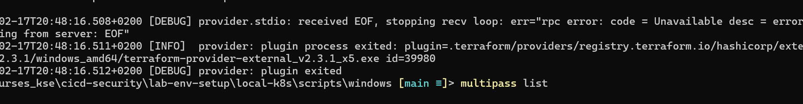

### Windows and Multipass

Sometimes the Multipass service becomes unresponsive. The symptoms look like the following:



When you run `multipass list`, the command hangs and does not return a response. This causes Terraform to get stuck with:

```
data.external.haproxy: Still reading... [00m20s elapsed]
...
```

To fix this, kill the `multipassd` process and restart the service:

```powershell
Stop-Process -Name multipassd -Force
sc start multipass
```

